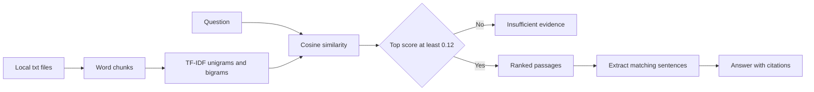

# Groundline

一个本地运行、证据可追溯的抽取式 RAG 工作台。它只回答 `docs/*.txt` 中能找到的内容，不调用外部大模型，也不会把文档发出这台机器。

[](https://github.com/wangkeyu-u/local-extractive-rag-service/actions/workflows/ci.yml)
[](https://www.python.org/)
[](https://fastapi.tiangolo.com/)
[](https://react.dev/)
[](#隐私与边界)


Groundline 适合用来理解和演示一条完整但不复杂的 RAG 链路。后端用 TF-IDF 和余弦相似度检索文本片段，再从命中的原文中抽取句子组成答案。前端把答案、引用、相关度、命中词和原始片段放在同一屏，方便检查每个结论从哪里来。

## 它能做什么

| 工作流 | 实际能力 |
| --- | --- |
| 查询 | 返回抽取式答案、置信状态、耗时和可点击引用 |
| 证据检查 | 展示来源文件、片段编号、排名、相似度和命中词 |
| 语料管理 | 从界面添加、覆盖、查看和删除 UTF-8 `.txt` 文件 |
| 索引配置 | 调整分块大小和重叠量，然后真实重建内存索引 |
| 拒答 | 最高分低于 `0.12` 时返回证据不足，不补写文档外内容 |
| 检索检查 | 用 4 条内置问题核对预期来源是否排在第一位 |

界面只面向桌面端。它采用固定的三栏检索控制台布局，没有手机导航、抽屉或移动端适配。

## 快速开始

需要 Python 3.10 到 3.12、Node.js 20+ 和 npm。

先启动 API：

```bash
python3.12 -m venv .venv
source .venv/bin/activate
pip install -r requirements.txt
uvicorn app:app --reload
```

再打开一个终端启动界面：

```bash
cd frontend
npm install
npm run dev
```

打开以下地址：

- 工作台: [http://127.0.0.1:5174](http://127.0.0.1:5174)
- OpenAPI: [http://127.0.0.1:8000/docs](http://127.0.0.1:8000/docs)

Vite 会把 `/api/*` 代理到本地 FastAPI。首次打开时，如果 `docs/` 中已有文本但索引为空，界面会自动完成第一次构建。

也可以使用 Makefile：

```bash
make install
make run

# 另一个终端
make frontend-install
make frontend-dev
```

## 使用方式

在 Corpus 页面点击 `Add .txt` 可以导入文本。文件会写入本地 `docs/`，随后立即重建索引。选择文件后可以查看原文、词数和分块数，也可以删除文件。

在 Query 页面输入问题并运行检索。答案中的数字引用会选中右侧对应证据。右侧面板显示完整片段、相似度和命中词，方便判断答案是否真的被文档支持。

设置面板中的 `Top K` 只影响查询。`Chunk size` 和 `Overlap` 会触发重新索引，健康接口会返回当前实际生效的参数。

Checks 页面包含一个很小的黄金集，用来快速发现 demo 语料的检索退化。它不是通用准确率测试，也不代表更大数据集上的表现。

## 检索链路



默认分块大小是 200 个词，重叠 40 个词。索引保存在当前 Python 进程内，服务重启后需要重新构建。重新构建失败时会清空旧索引，避免继续使用已经过期的结果。

## API

| Method | Endpoint | 用途 |
| --- | --- | --- |
| `GET` | `/health` | API 状态、索引状态和当前参数 |
| `POST` | `/index` | 使用指定分块参数重建索引 |
| `POST` | `/ask` | 检索证据并返回抽取式答案 |
| `GET` | `/documents` | 列出语料及统计信息 |
| `GET` | `/documents/{source}` | 读取一个文档的原文与统计 |
| `POST` | `/documents` | 新增或覆盖一个 `.txt` 文档 |
| `DELETE` | `/documents/{source}` | 删除文档并重建剩余索引 |

重建索引：

```bash
curl -X POST http://127.0.0.1:8000/index \
  -H "Content-Type: application/json" \
  -d '{"chunk_size":200,"chunk_overlap":40}'
```

新增文档：

```bash
curl -X POST http://127.0.0.1:8000/documents \
  -H "Content-Type: application/json" \
  -d '{
    "source":"release_notes.txt",
    "text":"Groundline answers only from local evidence.",
    "reindex":true
  }'
```

提问：

```bash
curl -X POST http://127.0.0.1:8000/ask \
  -H "Content-Type: application/json" \
  -d '{"question":"What is the refund policy?","top_k":3}'
```

一个证据片段包含 `source`、`chunk_id`、`rank`、`score`、`matched_terms` 和原文。完整请求与响应模型可以直接在 OpenAPI 页面查看。

## 验证

```bash
make check
```

当前检查包括 24 个后端测试、Vite 生产构建和依赖审计。测试覆盖分块、索引配置、文档增删改读、路径校验、检索排名、引用、拒答和失败重建。

GitHub Actions 会在 push 和 pull request 上运行后端测试、前端构建与完整依赖审计。

## 项目结构

```text
.
├── app/
│   ├── main.py          # FastAPI routes
│   ├── rag.py           # indexing, retrieval, extraction, corpus writes
│   └── schemas.py       # request and response models
├── docs/
│   ├── assets/          # GitHub preview
│   ├── interface-plan.md
│   └── *.txt            # local corpus
├── frontend/
│   ├── src/App.jsx      # query, corpus, checks, dialogs
│   ├── src/styles.css   # desktop visual system
│   └── vite.config.js   # local API proxy on port 5174
├── tests/test_rag.py
├── PRODUCT.md
├── Dockerfile
└── Makefile
```

## 隐私与边界

- 文档和索引都在本机。前端只请求 `127.0.0.1:8000`，查询历史只保存在浏览器本地存储。
- 没有账号、遥测、云向量库或外部模型请求。
- TF-IDF 依赖词汇重合，不擅长处理同义改写和跨语言查询。
- 抽取式回答不会生成文档外事实，但仍需要用户检查引用是否足以支持结论。
- 内存索引适合小型语料和演示，不适合多租户、大规模持久化检索或权限隔离。
- 文档名只允许字母、数字、点、短横线和下划线，并且必须以 `.txt` 结尾。单个文档正文最多 1,000,000 个字符。

完整的产品约束见 [PRODUCT.md](PRODUCT.md)，界面结构与交互说明见 [docs/interface-plan.md](docs/interface-plan.md)。
