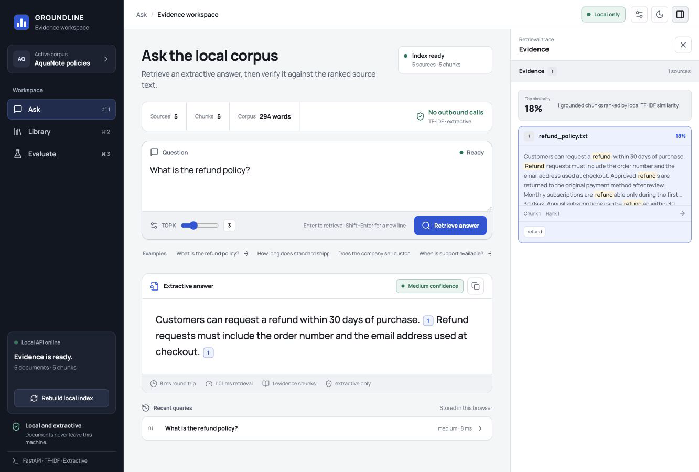
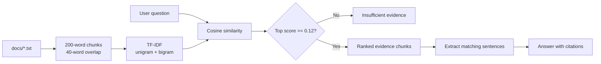

# Groundline — 本地抽取式 RAG 工作台

> 只从本地文档提取答案，把证据、分数和命中词放在结论旁边。无外部 LLM、无付费服务、无数据出站。
>
> Local-only extractive RAG with inspectable retrieval, cited answers, and zero model calls.

[](https://github.com/wangkeyu-u/local-extractive-rag-service/actions/workflows/ci.yml)
[](https://www.python.org/)
[](https://fastapi.tiangolo.com/)
[](https://react.dev/)
[](#隐私边界)



Groundline 是一个面向小型纯文本知识库的 RAG 演示项目。后端使用 FastAPI 和 scikit-learn 构建内存 TF-IDF 索引；回答完全由命中文档中的句子抽取而来。前端不只展示答案，还展示每条证据的来源、排名、相关度和精确命中词，并提供资料清单与一组可复现的检索评测。

它首先满足仓库内的 L1 RAG assessment 要求，同时把可解释性、可用界面和工程验证补齐。

## 为什么这个版本更完整

- **证据优先**：回答内的 `[1]`、`[2]` 引用可以直接定位右侧原文。
- **检索可解释**：每个片段返回 `rank`、`score`、`matched_terms` 和来源文件。
- **安全拒答**：最高相关度低于阈值时返回固定的证据不足回答，不继续猜测。
- **本地且确定**：没有 OpenAI、Anthropic、DeepSeek、Gemini 或其他外部模型调用。
- **三视图工作台**：Ask 负责问答，Library 负责语料盘点，Evaluate 负责 Top-1 黄金集评测。
- **可复现工程链路**：17 个后端测试、前端生产构建、GitHub Actions CI、Docker 后端镜像。
- **展示友好**：自动初始化索引、浏览器本地查询历史、深浅主题、明确的桌面工作台布局。
- **桌面证据控制台**：统一无衬线字体、紧凑数据层级、同屏答案与证据轨迹；不提供手机端导航或抽屉。

更详细的界面目标与桌面布局规则见 [docs/interface-plan.md](docs/interface-plan.md)。

## 界面信息架构

| 视图 | 要回答的问题 | 核心内容 |
| --- | --- | --- |
| **Ask** | “答案是什么，证据在哪里？” | 问题输入、抽取式回答、引用、证据侧栏、查询历史 |
| **Library** | “索引到底包含什么？” | 文档、字符数、词数、分块数、索引状态 |
| **Evaluate** | “检索现在可信吗？” | 4 条黄金问题、期望来源、Top-1 结果、通过率 |

## 工作原理



### 1. Index

`POST /index` 读取 `docs/` 下所有非空 `.txt` 文件，按 200 个词切分并保留 40 个词重叠，随后用带 unigram/bigram 的 TF-IDF 建立内存矩阵。重新索引会先清理旧状态，避免失败后继续使用过期索引。

### 2. Retrieve

`POST /ask` 将问题转换到同一向量空间，计算余弦相似度并返回 Top K。每个结果包含排名、分数和问题与片段之间的精确命中词。

### 3. Answer or refuse

最高分达到 `0.12` 时，服务从强证据片段中挑选与问题词重合最多的句子并追加引用编号；否则返回：

```text
I do not have enough evidence in the provided documents to answer this question.
```

## 快速开始

### 环境要求

- Python 3.10–3.12（固定的 scikit-learn 1.5.2 在这些版本上有稳定预编译包）
- Node.js 20+
- npm 10+

### 1. 启动后端

```bash
python3.12 -m venv .venv
source .venv/bin/activate
pip install -r requirements.txt
uvicorn app:app --reload
```

后端地址：`http://127.0.0.1:8000`<br>
OpenAPI 文档：`http://127.0.0.1:8000/docs`

也可以使用 Makefile：

```bash
make install
make run
```

### 2. 启动前端

打开另一个终端：

```bash
cd frontend
npm install
npm run dev
```

前端地址：`http://127.0.0.1:5173`

Vite 会把 `/api/*` 代理到 `http://127.0.0.1:8000/*`。首次连接后，界面会在索引未就绪时自动调用一次 `POST /index`。

## API

| Method | Endpoint | 作用 |
| --- | --- | --- |
| `GET` | `/` | 服务版本与端点概览 |
| `POST` | `/index` | 读取本地文档并重建内存索引 |
| `POST` | `/ask` | 检索证据并返回抽取式答案 |
| `GET` | `/documents` | 返回语料文件及字符、词、分块统计 |
| `GET` | `/health` | 返回 API、索引和最近索引时间 |
| `GET` | `/docs` | FastAPI 自动生成的 OpenAPI UI |

### 建立索引

```bash
curl -X POST http://127.0.0.1:8000/index
```

```json
{
  "status": "indexed",
  "documents_indexed": 5,
  "chunks_indexed": 5,
  "sources": [
    "privacy_policy.txt",
    "product_overview.txt",
    "refund_policy.txt",
    "shipping_policy.txt",
    "support_policy.txt"
  ],
  "chunk_size": 200,
  "chunk_overlap": 40,
  "indexed_at": "2026-07-16T07:14:16.000000+00:00"
}
```

### 提问

```bash
curl -X POST http://127.0.0.1:8000/ask \
  -H "Content-Type: application/json" \
  -d '{"question":"What is the refund policy?","top_k":3}'
```

```json
{
  "answer": "Customers can request a refund within 30 days of purchase. [1]",
  "confidence": "medium",
  "retrieval_ms": 0.55,
  "query_terms": ["policy", "refund"],
  "chunks": [
    {
      "source": "refund_policy.txt",
      "chunk_id": 0,
      "rank": 1,
      "score": 0.1831,
      "matched_terms": ["refund"],
      "text": "Customers can request a refund within 30 days of purchase..."
    }
  ],
  "sources": [
    {
      "source": "refund_policy.txt",
      "chunk_id": 0,
      "rank": 1,
      "score": 0.1831,
      "matched_terms": ["refund"],
      "text": "Customers can request a refund within 30 days of purchase..."
    }
  ]
}
```

`sources` 保留为 `chunks` 的兼容别名；新客户端可以直接使用 `chunks`。

## 错误与边界行为

| 场景 | 行为 |
| --- | --- |
| 索引前提问 | `400` — `no index found` |
| 空问题 | `400` — `empty question` |
| 缺少 `docs/` | `400` — `docs folder not found` |
| `docs/` 没有 `.txt` | `400` — `no text documents found in docs folder` |
| 所有文档为空 | `400` — `documents are empty; no index can be built` |
| 文档无可检索词 | `400` — `documents do not contain searchable text; no index can be built` |
| 证据低于阈值 | `200`，`confidence=insufficient`，证据数组为空 |

## 测试与质量检查

```bash
# Backend — 17 tests
.venv/bin/python -m pytest -q

# Frontend production build
cd frontend && npm run build

# Both through Make
make check
```

测试覆盖分块重叠、索引、文档元数据、健康状态、相关查询、拒答、输入校验、失败重建清理、检索排名、置信度阈值与 API 响应结构。

CI 在每次 push 和 pull request 上运行 Python 3.12 测试、前端构建与高危依赖审计。

## 项目结构

```text
.
├── app/
│   ├── main.py          # FastAPI routes and CORS
│   ├── rag.py           # chunking, TF-IDF, retrieval, extraction
│   └── schemas.py       # request and response models
├── docs/
│   ├── assets/          # README preview
│   ├── interface-plan.md
│   └── *.txt            # local knowledge corpus
├── frontend/
│   ├── src/App.jsx      # Ask / Library / Evaluate workbench
│   ├── src/styles.css   # desktop interface system and themes
│   └── vite.config.js   # local API proxy
├── PRODUCT.md           # product and interface constraints
├── tests/test_rag.py
├── .github/workflows/ci.yml
├── Dockerfile
├── Makefile
└── requirements.txt
```

## Docker

当前镜像刻意只打包评测要求中的 Python API：

```bash
docker build -t local-extractive-rag-service .
docker run --rm -p 8000:8000 local-extractive-rag-service
```

然后访问 `http://127.0.0.1:8000/docs`。

## 隐私边界

- 后端只读取本机 `docs/*.txt`。
- 检索矩阵只存在于当前进程内，服务重启后需要重新索引。
- 前端只向本地 FastAPI 发送问题；查询历史仅存于浏览器 `localStorage`。
- 没有遥测、账号系统、云向量库或外部模型请求。

## 设计取舍

| 选择 | 优点 | 局限 |
| --- | --- | --- |
| TF-IDF | 快、确定、容易解释 | 不理解真正的语义改写 |
| unigram + bigram | 保留短语信息，仍然轻量 | 词汇不重合时召回较弱 |
| 抽取式回答 | 不会生成文档外事实 | 文风不如生成模型自然 |
| 固定阈值 | 拒答行为清晰可测试 | 语料变大后需要重新标定 |
| 内存索引 | 零基础设施、适合演示 | 无持久化、无横向扩展 |
| 只读语料目录 | 边界简单、安全 | 前端不直接上传或删除文件 |

## 下一步

- 用更大的标注集校准 `MIN_SCORE`，报告 Precision@K / Recall@K。
- 在仍保持本地的前提下增加 BM25 或本地 embedding 作为可选检索器。
- 为大语料增加持久化索引与增量更新。
- 在真正的多人场景中补认证、文档级权限与审计日志。
