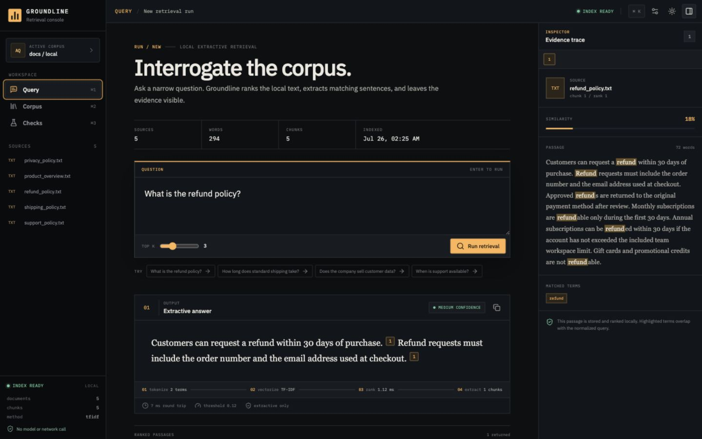

# Local Extractive RAG

本地文本问答服务：用 TF-IDF 检索文档片段，再抽取原文中的回答与证据。不调用外部模型 API。



## 运行

需要 Python 3.10+。从仓库根目录执行：

```bash
python3 -m venv .venv
source .venv/bin/activate
pip install -r requirements.txt
make run
```

API 位于 `http://127.0.0.1:8000`，接口文档为 `/docs`。另开终端启动界面：

```bash
cd frontend
npm ci
npm run dev
```

前端默认位于 `http://127.0.0.1:5173`，通过 Vite 代理访问后端。可用根目录和前端的 `.env.example` 调整本地端口。

## 索引与提问

```bash
curl -X POST http://127.0.0.1:8000/index
curl -X POST http://127.0.0.1:8000/ask \
  -H 'Content-Type: application/json' \
  -d '{"question":"What is the refund policy?","top_k":3}'
```

`POST /index` 读取 `data/documents/*.txt`；仓库中的五份政策是虚构产品的示例语料。替换或添加文本后需要重新索引。`GET /documents` 列出当前输入，`GET /health` 返回索引状态。

回答带 `source`、`chunk_id`、`score` 和原文。分数不足时返回证据不足与空证据列表；这条阈值规则不能保证语义正确。索引只存在于内存，重启后需重建。

## 目录

| 路径 | 用途 |
| --- | --- |
| `app/` | HTTP Schema、索引、检索和抽取 |
| `data/documents/` | 可索引的示例文本，与开发文档分离 |
| `frontend/` | React/Vite 本地界面 |
| `tests/` | API、检索和输入边界回归 |
| `docs/assets/` | 项目展示图片 |

## 验证与容器

```bash
make test
cd frontend && npm run build
```

后端容器会复制同一份示例语料：

```bash
docker build -t local-extractive-rag-service .
docker run --rm -p 8000:8000 local-extractive-rag-service
```

这是小型本地原型。TF-IDF 依赖词面重合，没有语义嵌入、持久化索引或文档上传流程；虚构语料上的回归通过不能证明对真实业务文档同样有效。
