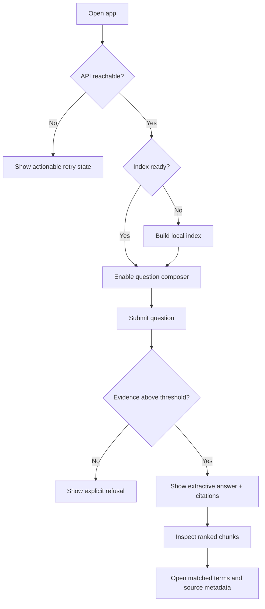

# Groundline Interface Plan

## 1. Product intent

Groundline is not a general AI chat product. It is a local evidence desk for a small corpus. The interface should help a user answer three questions in order:

1. Is the local index ready?
2. What does the corpus support?
3. Can I inspect the exact source behind the answer?

The visual direction is a **modern evidence console**: cool neutral surfaces, a dark navigation rail, a restrained cobalt interaction color, and compact data views. It behaves like a desktop product rather than a marketing page, and deliberately avoids both generic chatbot UI and decorative editorial styling.

## 2. Primary users

| User | Goal | Product emphasis |
| --- | --- | --- |
| Reviewer / interviewer | Understand the pipeline quickly | Visible local status, deterministic controls, clear limitations |
| Developer | Debug retrieval | Scores, ranks, matched terms, chunk ids |
| Knowledge user | Get a verifiable answer | Concise extractive copy and clickable citations |

## 3. Information architecture

### Persistent left rail

- Product and corpus identity
- Ask / Library / Evaluate navigation
- Local API and index status
- Reindex action
- Explicit “no model calls” privacy statement

### Ask

- Corpus metrics establish readiness before the question.
- The composer exposes only query-time `Top K`; fixed pipeline constants remain in code.
- The answer card shows confidence, round-trip time, retrieval time, evidence count, and method.
- Inline citations select the matching item in the evidence rail.
- Recent queries live only in browser storage.

### Library

- Read-only document inventory mirrors the assessment's `docs/*.txt` boundary.
- File name, word count, character count, chunk count, and index state are visible.
- The add-material guide explains the actual workflow instead of pretending the API supports upload.

### Evaluate

- Four transparent golden questions are versioned in the frontend.
- Each case compares the expected source with the actual Top-1 source.
- The summary reports accuracy and average similarity without overstating what the test proves.

## 4. Core interaction flow

## 5. Desktop layout behavior

| Width | Behavior |
| --- | --- |
| `> 1180px` | Full 236px navigation, answer canvas, 360px evidence rail |
| `980–1180px` | 76px icon navigation, 320px evidence rail, tighter content spacing |
| `< 980px` | Unsupported; the interface preserves a 960px desktop canvas instead of switching to phone UI |

The product is intentionally designed for desktop use. Phone-sized navigation, drawers, and mobile-specific interaction patterns are out of scope. Reduced-motion preferences still collapse nonessential animation.

## 6. States that must stay explicit

- API offline
- Index pending / indexing / ready
- Empty evidence trace
- Asking
- Low or insufficient evidence
- Evaluation pending / running / pass / review
- Recoverable request error

## 7. Accessibility baseline

- Semantic `main`, `nav`, `aside`, form, heading, and button elements
- Visible keyboard focus
- Text labels on all icon-only controls
- Stable accessible names remain when compact desktop CSS hides visible navigation labels
- Enter to submit and Shift+Enter for a new line
- `Cmd/Ctrl + 1/2/3` navigation shortcuts
- Color is reinforced with text and icons for status
- `prefers-reduced-motion` support

## 8. Deliberate non-goals

- No fake document uploader without a matching backend endpoint
- No auth or multi-tenant navigation
- No editable chunking parameters that suggest runtime support the backend does not have
- No generative-model controls in a strictly extractive project
- No inflated “semantic accuracy” claims from a four-case Top-1 check

## 9. Visual system

- One sans-serif family (Manrope) across interface copy, controls, answer text, and diagnostics.
- 14px base text with a restrained fixed type scale; no oversized or fluid marketing headlines.
- White or near-black product surfaces over a cool neutral canvas, with one-pixel structural borders and minimal elevation.
- Cobalt indicates actions and selection; green, amber, and red are reserved for explicit system states.
- Full-surface selection replaces decorative side stripes. Gradients, stamps, glass effects, and ornamental metadata are out of scope.
- Ask keeps the answer and ranked evidence visible in one desktop workspace; Library and Evaluate use compact tables optimized for scanning.
